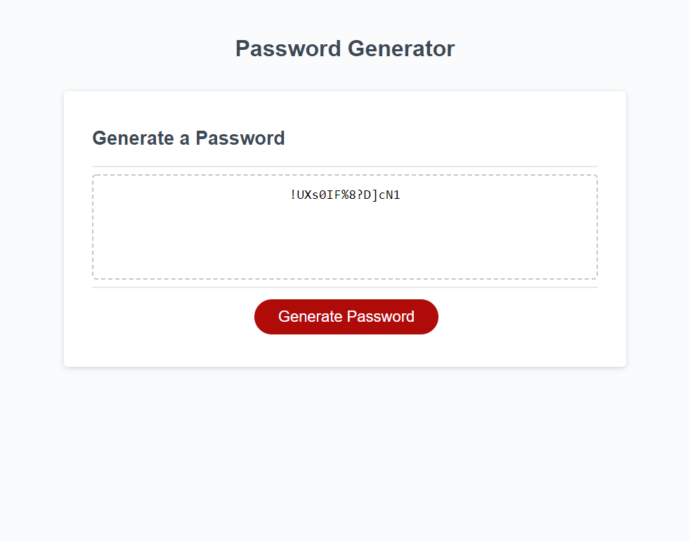

# **cryptic-parakeet**

## **Description**
Our goal this time was to write a code that would prompt the user to indicate their choise of criterias for a randomly generated password and present them.
At first, the task seemed quite daunting as we had not really gone over specific codes however, critical thinking and logical processing helped me break through with a solution. Again, this provided further realization that there are many solutions that could possibly give similar results.
I tried to eliminate any repetitive line of code and condense most of the processes into a function/method.

## **Features**
- Termination after 'cancel' is selected in the first prompt and when the 8 to 128 criteria is not met
- The confirm choices and password character sets are added to the element of the variables
- Then character sets are omitted based on the confirm choices
- Password is generated based off the criteria and presented on the website

---

### Website: [cryptic parakeet](https://lonelymitoc.github.io/cryptic-parakeet/)